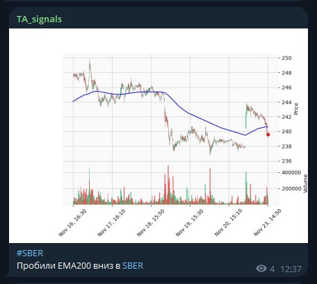

# Структура проекта
- db_updater.py - скрипт, который записывает данные из алгопака в БД по мере их поступления.
- breakout_ema.py - скрипт, который присылает сигналы о пробое EMA в тг канал. Работает в реальном времени, получает данные из БД.
- plotter.py - вспомогательный скрипт для отрисовки и отправки сигнала.
- result_strategies.ipynb - ноутбук с результатами бэктестов различных версий робота (тесты проводились на SBER, SMLT, KZOS).
- config.py - для настройки некоторых параметров.
- vars.py - приватные параметры.
# Пример сигнала
